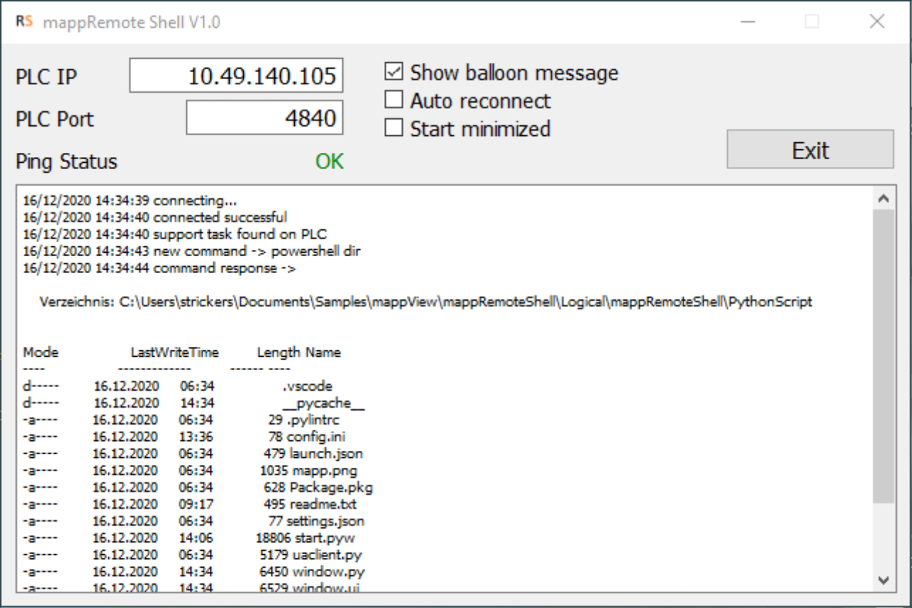
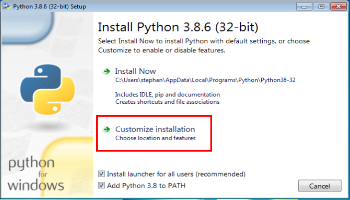
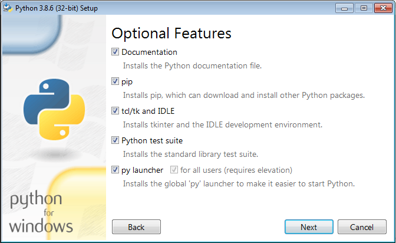
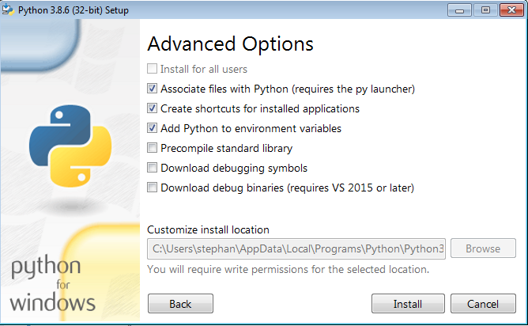

## Table of Contents
* [Introduction](#Introduction)
* [Requirements](#Requirements)
* [Installation](#Installation)
* [Samples](#Samples)
* [Revision History](#Revision-History)

<a name="Introduction"></a>
## Introduction
This is a sample project to execute a shell command on a remote PC. The remote command is executed with a Python script that connects via OPC UA to the B&R PLC. The PLC only needs the variable structure to execute command and some code to indicate the connection status. The sample uses a mappView visualization for demo purpose but mappView is not required to run the sample. The variable structure mappRemoteShell has the following members:

* execute &nbsp;&nbsp;&nbsp;&nbsp;&nbsp;&nbsp;&nbsp;&nbsp;&nbsp;&nbsp; Starts the remote command. The Python script resets this variable when the command is finished.
* command &nbsp;&nbsp;&nbsp;&nbsp;&nbsp;&nbsp; The shell command that is excecuted on the remote PC
* alive_counter &nbsp; This counter is used to detect the connection state
* connected &nbsp;&nbsp;&nbsp;&nbsp;&nbsp;&nbsp; Indicates that the remote PC is connected and ready to receive a command
* status  &nbsp;&nbsp;&nbsp;&nbsp;&nbsp;&nbsp;&nbsp;&nbsp;&nbsp;&nbsp;&nbsp;&nbsp;&nbsp; The status of the command

The following status codes show the state of the command<br/>
65535 &nbsp;The command is still busy<br/>
10000 &nbsp;Generic command error<br/>
10001 &nbsp;The command timed out<br/>
0 &nbsp;&nbsp;&nbsp;&nbsp;&nbsp;&nbsp;&nbsp;&nbsp; The command was successful

<br/><br/>

The Python script can run on any system that supports the Python framework. The logger gives a detailed feedback about the connection status and executed command. The option for balloon messages will show a notification every time a command is executed. Auto reconnect will automatically connect when the script is started or when the connection was interrupted. Start minimized will put the application into the system tray on startup. 

<a name="Requirements"></a>
## Requirements
* Automation Studio 4.7
* Automation Runtime C4.72
* Python 3.8 or higher

Recommended task class is #8 with a 10ms cycle time.

<a name="Installation"></a>
## Installation

### PC

Download and install Python from www.https://www.python.org/

Start the installation, set checkboxes, customize installation

<table><tr><td></td><td></td><td></td></tr></table>

Open a command window and execute the following commands to install the required packages

* pip install PyQt5
* pip install opcua
* pip install timeloop
* pip install ConfigParser

Copy the folder \Logical\mappRemoteShell\PhythonScript to the target PC

Run the file start.pyw from the PhythonScript folder

### B&R PLC
* Copy the package mappRemoteShell into new project
* Activate OPC UA server in the PLC configuration
* Enable the variable structure "mappRemoteShell" in the OPC UA configuration including all the sub elements

<a name="Samples"></a>
## Samples
Here are few examples that can be used as command string.

* Start Windows file explorer ``` explorer.exe ```
* Start Automation Studio ``` C:\BrAutomation\AS47\Bin-en\AutomationStudio.exe ```
* Start Power Shell script with parameter ``` powershell C:\Temp\GoogleRoute.ps1 ```

<a name="Revision-History"></a>
## Revision History

#### Version 0.1
* First release
